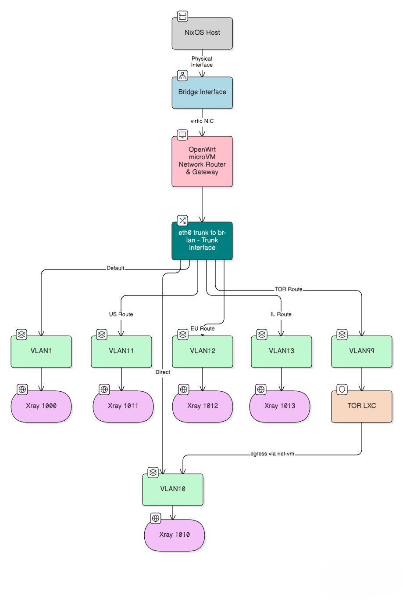

## 1. Network Architecture

Once booted, the laptop has a single VLAN-aware bridge with a static IP address. The bridge, together with all networking hardware devices (PCI and USB) are delegated to the `OpenWRT VM`. It provides `DHCP` and policy-based routing via VLANs. All host processes egress by default via untagged `VLAN 1` (smart route through Xray port `1000`).

## 2. OpenWRT VM Management

Host `NixOS` has access to a pre-baked `OpenWRT` image with one bridge configured at `10.77.0.0/24`, which is stored in `/nix/store`. Upon boot it unpacks the image, copies it to `/run/openwrt/` and then creates a micro-VM that uses this image as boot disk. The micro-VM has sufficient `RAM` (64 MiB), and number of cores (1-2). The default IP address in `OpenWRT` is `10.77.0.1`.

## 3. Micro-VM

### 3.1. Micro-VM Initialization Process

Right after the creation of the micro-VM, the host process checks if `OpenWRT` is accessible at its default IP address `10.77.0.1` from the bridge's static IP `10.77.0.2`. If it is, the host process pushes all configuration and policy-based routing rules to `OpenWRT` via `UCI` and restarts the relevant services (`network`, `firewall`, `dnsmasq`, etc.). Waits for the proper `VLAN` interfaces to be pingable via the bridge.

#### 3.1.1. Post-boot `UCI` Configuration

- VLAN-aware bridge setup via `config bridge-vlan` sections.
- Per-VLAN interfaces and addressing.
- DHCP ranges for each VLAN segment.
- Policy-based routing rules connecting VLANs to `Xray`/`XTLS` listeners.
- Firewall zones and forwarding rules per VLAN.

### 3.2. VLAN Network Scheme

Proposed VLAN scheme on single bridge `br0`. `OpenWRT` serves all VLANs via **policy-based routing** combined with **transparent proxy interception** using `Xray`/`XTLS` `dokodemo-door` listeners.

### 3.3. Traffic Flow Architecture

The routing process involves two distinct stages:

1. **Policy-Based Routing**: Routes traffic from `VLAN` interfaces to appropriate gateways based on source subnet using connection marks
2. **Traffic Interception**: Transparent proxy rules redirect routed traffic to specific `Xray` listener ports using `nftables` REDIRECT

### 3.4. VLAN Configuration

- `VLAN 1` (untagged): Routes via default gateway, intercepted to Xray port `1000` (smart route, default for host processes)
- `VLAN 10`: Routes via direct gateway, intercepted to Xray port `1010` (direct route)
- `VLAN 11`: Routes via US gateway, intercepted to Xray port `1011` (US route)
- `VLAN 12`: Routes via EU gateway, intercepted to Xray port `1012` (EU route)
- `VLAN 13`: Routes via Israel gateway, intercepted to Xray port `1013` (Israel route)
- `VLAN 99`: TOR handled by a separate **non-privileged** LXC; TOR egress to internet routes via `VLAN 10` (direct)

### 3.5. Implementation Details

**Subnets:**

- `VLAN 1` (untagged): `10.77.0.0/24` (gateway `10.77.0.1`)
- `VLAN 10`: `10.77.10.0/24` (gateway `10.77.10.1`)
- `VLAN 11`: `10.77.11.0/24` (gateway `10.77.11.1`)
- `VLAN 12`: `10.77.12.0/24` (gateway `10.77.12.1`)
- `VLAN 13`: `10.77.13.0/24` (gateway `10.77.13.1`)
- `VLAN 99`: `10.77.99.0/24` (gateway `10.77.99.1`, TOR LXC, egress via `VLAN 10`)

**Traffic Marking and Interception using nftables:**

```bash
# Mark connections by source VLAN interface
nft add rule ip mangle PREROUTING iifname "br-lan.11" counter ct mark set 11
nft add rule ip mangle PREROUTING iifname "br-lan.12" counter ct mark set 12
nft add rule ip mangle PREROUTING iifname "br-lan.13" counter ct mark set 13

# Restore connection marks for routing decisions
nft add rule ip mangle OUTPUT counter meta mark set ct mark

# Transparent proxy redirection to Xray ports
nft add rule ip nat PREROUTING iifname "br-lan.11" tcp dport != 1011 counter redirect to 1011
nft add rule ip nat PREROUTING iifname "br-lan.12" tcp dport != 1012 counter redirect to 1012
nft add rule ip nat PREROUTING iifname "br-lan.13" tcp dport != 1013 counter redirect to 1013
```

**Policy-Based Routing Rules:**

```bash
# Route marked traffic through appropriate tables
ip rule add fwmark 11 table 11
ip rule add fwmark 12 table 12
ip rule add fwmark 13 table 13

# Configure routing tables with appropriate gateways
ip route add default via 10.77.11.1 table 11  # US route
ip route add default via 10.77.12.1 table 12  # EU route
ip route add default via 10.77.13.1 table 13  # Israel route
```

This architecture separates **Layer 3 routing decisions** (handled by PBR using fwmark) from **application-level traffic steering** (handled by `nftables` transparent proxy redirection), ensuring technically accurate implementation while maintaining the desired traffic flow policies.

### 3.6. Network Topology



### 3.7. Service Containerization

Services requiring special form of outside connectivity are run as separate **non-privileged** `LXC` containers with declarative `NixOS` configuration, UI output via `Xwayland`, attached to specific VLANs on the single bridge for policy-based routing. The `TOR` container runs in `VLAN 99` and its egress to the internet is routed via `VLAN 10` (direct) through the net‑vm.

#### 3.7.1. Container VLAN Assignment

Containers are assigned to VLANs using NixOS declarative configuration:

```nix
virtualisation.incus.instances.chromium-vlan11 = {
  profiles = [ "default" "chromium-vlan11" ];
  # Container gets 10.77.11.x address via DHCP
  # Traffic routes through Xray port 1011 (US policy)
};
```

### 3.8. Key Properties

- Single VLAN-aware bridge `br0` handles all traffic separation.
- OpenWrt image pre-configures base bridge at `10.77.0.0/24`.
- Post-boot `UCI` configuration adds VLAN interfaces and policy routing.
- Host has static IP on `br0`, so OpenWrt is reachable at `10.77.0.1`.
- Each VLAN provides isolated L3 segment with dedicated DHCP and proxy policy.
- `Xray`/`XTLS` transparent proxy handles per‑VLAN traffic steering via dokodemo‑door.
- All host processes egress by default via `VLAN 1` (Xray port `1000` smart route).
- `TOR` **non-privileged** LXC runs on `VLAN 99` and egresses to the internet via `VLAN 10` (direct).
